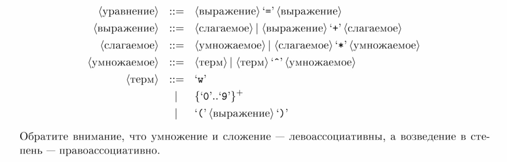

# Ordinal calculator

Реализация калькулятора ординалов. Подробнее про них можно почитать здесь https://en.wikipedia.org/wiki/Ordinal_arithmetic

Сборка. Запуск может быть сделан с помощью Maven (подразумевается, что maven у вас уставновлен).

```bash
mvn compile
...
mvn exec:java -q
<Входные данные согласно грамматике>
<Результат Равны/Больше/Меньше>
```
Грамматика: 

Работа способность была проверна только на линуксе